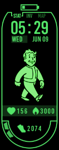

# Pipboy Watch Face (Mi Band 8)

This is a custom watch face for the Mi Band 8.

It shows
- battery status 
- time
- current date and day of the week
- Heartbeat
- burnt calories
- steps (progress bar and stepcount)

Depending on your stepcount it shows a different Vaultboy

  

## How to use and modify

It was created with the watchface maker: 
https://www.mibandwatchfaces.com/mi_band8_watchface_maker/

With it you create a json file which contains all the details of the watchface.
This project contains the json file `wfDef.json` for this watchface. 

You then have to export it as a .zip and add it with the app MiBand 8 Watchfaces (for Android)
to your Mi Band 8.